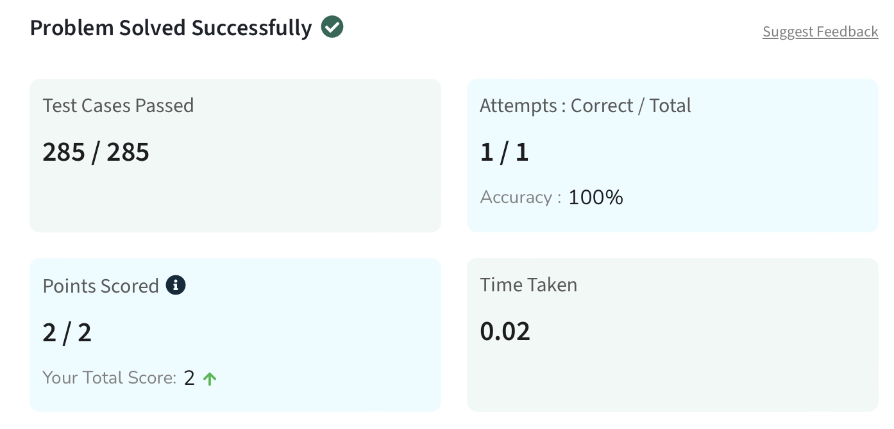
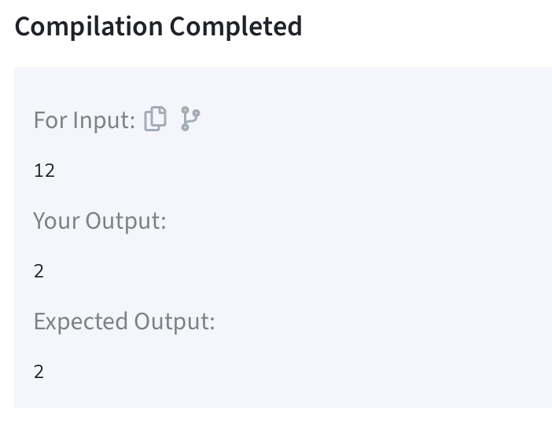

# Python DSA Solution: Count Digits that Evenly Divide a Number

This repository provides a Python class `Solution` with a method `evenlyDivides` designed to count digits in a number `N` that evenly divide `N`.

## `Solution` Class Description

The `Solution` class contains method for solving various algorithmic problems in Python.

### Method `evenlyDivides(N)`

This method takes an integer `N` as input and counts how many digits in `N` are divisors of `N` itself.

#### Parameters

- `N` (int): The number to analyze.

#### Returns

- `count` (int): Number of digits in `N` that evenly divide `N`.

#### Result

#### Sample Output

