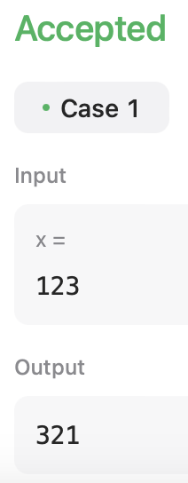

# Python DSA Solution: Reverse Integer

This repository provides a Python class `Solution` with a method `reverse` designed to reverse an integer `x` while considering the 32-bit signed integer limits.

## `Solution` Class Description

The `Solution` class contains methods for solving various algorithmic problems in Python.

### Method `reverse(x: int) -> int`

This method reverses the digits of the integer `x` and returns the reversed integer. It handles both positive and negative integers, ensuring the reversed number does not exceed the 32-bit signed integer range.

#### Parameters

- `x` (int): The integer to reverse.

#### Returns

- `int`: The reversed integer.
- `0`: If reversed integer is out of range.

#### Output

